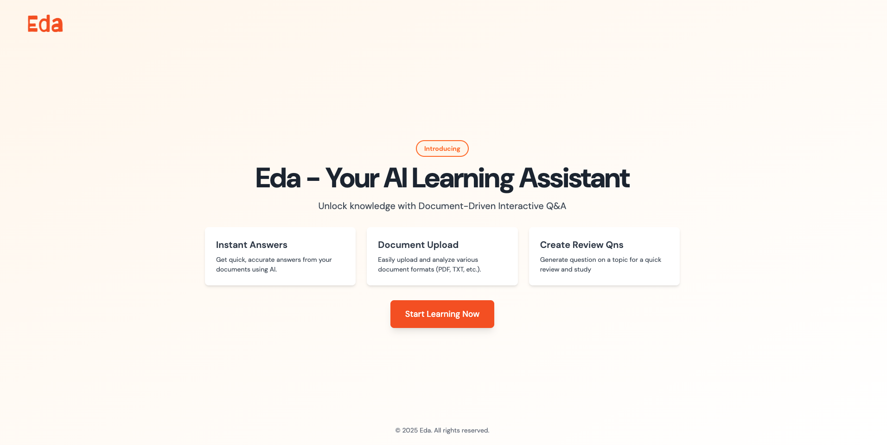

# AI-Powered Learning Assistant 


## Overview
The AI-Powered Learning Assistant is an intelligent tool designed to enhance learning experiences by leveraging Retrieval-Augmented Generation (RAG). Users can upload documents, and the assistant processes the content to generate conversational responses, enabling an interactive learning experience. In addition to the chat-based interface, the platform also includes a flashcard feature that helps users reinforce key concepts and retain information more effectively.

**Live Demo:** [eda.briantemu.dev](https://eda.briantemu.dev)

## Features
- **Document-Based Learning** – Users upload documents, and the AI generates interactive responses.
- **AI-Powered Q&A** – Provides answers and explanations based on the document's content.
- **Content Summarization** – Extracts key points from uploaded materials.
- **Interactive Chatbot** – Engages users in meaningful discussions based on document context.
- **Flashcard Generator** – Generate flashcards with answers and explanation.


## Limitations

- Image Understanding: Cannot interpret images, intricate visuals, or non-textual graphics (e.g., diagrams, abstract art).
- Table Processing: Struggles to accurately extract or interpret data from complex tables.
- Dont handle multiple document uploads (current only handles pdf)

## Technology Stack
- **Backend:** Python, Flask/FastAPI, LangChain
- **Frontend:** Next.js, TailwindCSS
- **Database:** Vector Databases (ChromaDB)
- **AI Models:**  Transformer-based models, LLM
- **Deployment:** Vercel, Railway

## Installation
### Clone the Repository
```sh
git clone https://github.com/iam-dante/eda.git
cd eda
```

### Install Dependencies
```sh
pip install -r ./server/requirements.txt
```

### Run the Application
```sh
# Start backend
python ./server/app.py

# Start frontend
yarn run dev
```

## Usage
1. Upload a document through the web interface.
2. Interact with the chatbot to receive responses based on the document's content.
3. Get summaries, explanations, and insights from the uploaded material.
4. Engage in a dynamic learning experience with AI-driven conversations.

##  License
This project is licensed under the [MIT License](LICENSE).
